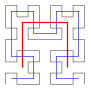

### Notes

An algorithm that is more efficient and works in arbitrary dimensions
without relying on awkward recursions and geometry alignment
is described in
[John Skilling; Programming the Hilbert curve. AIP Conf. Proc. 21 April 2004; 707 (1): 381–387](https://doi.org/10.1063/1.1751381).

### Overview

This repository contains recursion-based implementation of Hilbert Curve Sorting algorithms for 2-tuples and 3-tuples, in C++ and TS.

### Motive

Sorting, by intuition, gives an ordering of a set where the distance between neighboring elements is minimized.
It is heavily used for DB indexing, visualization and a myriad of other purposes.

> The distance may be measured in Hamming Distance for bits, or Euclidean 2-norm for vectors.

Sometimes our data is multidimensional,
like sRGB colors { $(r, g, b)|r, g, b \in [0, 255]$ },
or vectors in $\mathbb{R}^n, n \gt 1$ in general.
Unlike the real numbers $\mathbb{R}$,
we encounter challenges when trying to sort data in higher dimensional spaces.

The simplest sort one might use is the Lex Order, which compares the first non-identical component of tuples, but this approach has many flaws.

> Just take $[00, 01, 10, 11]$ as an example, Lex Order will return the original sequence, which fails to minimize element-wise Hamming Distance.  
> A better ordering is $[00, 01, 11, 10]$, which is the Gray Code sequence $G_2$.

### Solution

Mapping from $\mathbb{R^n}$ to $\mathbb{R}$
could be achieved through the inverse map of Hilbert Curves,
which are space-filling curves whose limit is an n-hypercube.

> Technically the Hilbert Curves maps the unit interval $[0, 1]$ to the unit n-hypercube $U\_n$, but the hypercube could be offsetted and scaled to fit our data.

Neighboring tuples in the input space will also end up close to each other on the Hilbert Curve,
preserving the spatial relationship between the input points.
$\mathbb{R^n}$ with the ordering will possess a total order.

### Implementation

Some key properties of the Hilbert Curves that allows us to implement a recursive algorithm is,
that they are locality-preserving space-filling curves,
and that they are fractals. Details below.

-   Locality-preserving - Points on the Hilbert Curve converges to a definite point as iteration count increases.

    > This is in general not true for other curves, where the resulting points might shift vastly over iterations.

-   Fractalness - Every iteration $\mathbb{H}(n)$ implicitly traces (scaled) $\mathbb{H}(n-k), k \le n$ curves.

> 
> 
>   
> _H_2 Overlay, First 3 Iterations ~ Fractalness_  
> _Images by Geoff Richards (Qef) - Own work, Public Domain_

---

Now, take the $U\_2$ case as an example for simplicity of illustration.

Divide $U\_2$ into 4 quadrants, denoted by $'00, 01, 11, 10'$ respectively (the 1st bit represents if $x \gt 0.5$ and the 2nd, $y \gt 0.5$).
Notice, by fractalness of the curve, no matter how high the iteration count (even at $\infty$, where its limit _is_ $U\_2$),
points in $01$ always come after the ones in $00$, the ones in $11$ always come after the ones in $01$, and so on.

> The orientation of $n$-d Hilbert Curve is based off the Gray Code sequence $G\_n$, interpreting the bits as mentioned above, generalized.  
> This is intuitive as the Gray Code is a permutation of the Bit Code, which contains every vertex of $U\_n$, and only one bit (axis) is flipped (shifted) between successive Gray Code bits.

This allows us to divide an arbitrary number of points into quadrants and sort the quadrants instead, after which we concatenate the results in $\mathbb{H\_2}(1)$ order, recursively.
Before sorting the quadrants, they must be rotated or flipped and offsetted to fit
$\mathbb{H\_2}(1)$, as the recursive algorithm divides the square according to it.

The recursion base will be when there are only 1 or none vector left, or if all vectors are identical. The input vectors will be returned.

The recursion step will offset and scale the vectors to fit a hypercube, run recursion, and return de-fitted result vectors.

The $U\_3$ case is essentially the same.

### Demo

An interactive demo [GitHub Page](https://carbonicsoda.github.io/hilbert-curve-sort/). It contains demos of:

-   2-D points sorting - connects set / random 2-D points according to the sorted sequence.

    > The result from sorting random points will roughly estimate a Hilbert curve.

-   Colors (sRGB) sorting - sorting sRGB colors, using $(R, G, B)$ as the color vector, with a pre- / post-sort comparison.
    > The result would be more gradient-like (overall) than the raw version.  
    > HSL might give better results (?), you could experiment with it freely, through minor changes to the _assets/demo.html_ script source code.

### Notes

The time complexity of the algorithms is estimated to be $O(n)$ where n is the number of vectors in the hypercube
(complexity analyzed w.r.t. number of total function calls). This, however, ignores constant factors and the overhead of recursion function calls.

Space complexity of the algorithms is expected to be high, as recursion is heavily used.

Overall performance should be pretty good, as a toy. But since $n$ scales with $(s + 1)^n$, where $s$ is side length of hypercube and $n$ is hypercube's dimension.
This might get extremely computational and memory demanding as $s$ scales.  
(Adopt Skilling's algorithm for practical or general usages,
which only involves cheap bit-wise operations
and can also work in N-dimensions)

> Here the complexities are estimated assuming uniform distribution of points in the hypercube (spacing 1),
> so performance shall not be a problem in most cases.

### Misc

Generalization to higher dimensions is possible but much more complicated with recursion.
Here I only implemented the $\mathbb{H\_2}$ and $\mathbb{H\_3}$ algorithms in C++ and TS.

The algorithms could be used for fast approximations of the Travelling Salesman Problem.
A test was run on [pla85900.tsp](https://github.com/CarbonicSoda/tsp-hilbert-curve-benchmark/blob/master/pla85900.tsp) that contains 85900 nodes.
The final distance 188465250 (CEIL_2D) is only a rough x1.32 of the Mathematically optimal distance 142382641 (CEIL_2D).
That might seem quite bad, but many dedicated approximation algorithms do no better, yet this algorithm is more efficient.
([details](https://github.com/CarbonicSoda/tsp-hilbert-curve-benchmark))
